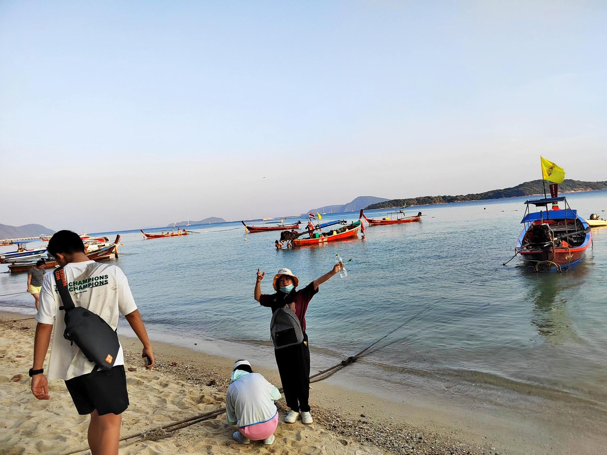
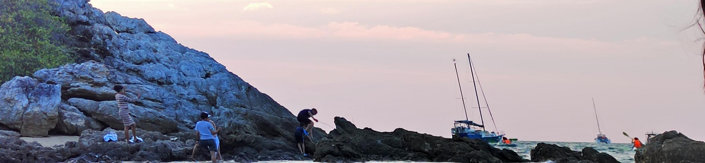
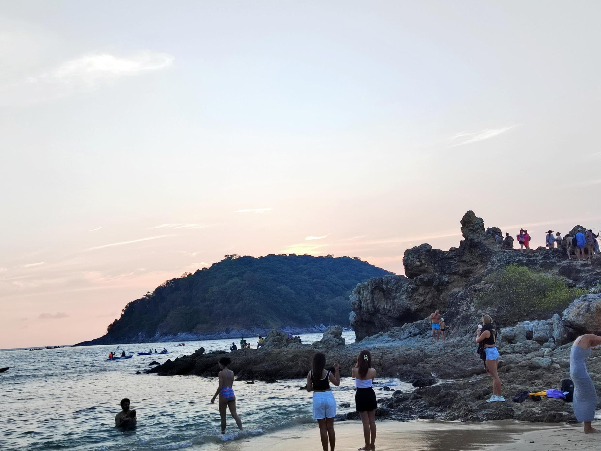
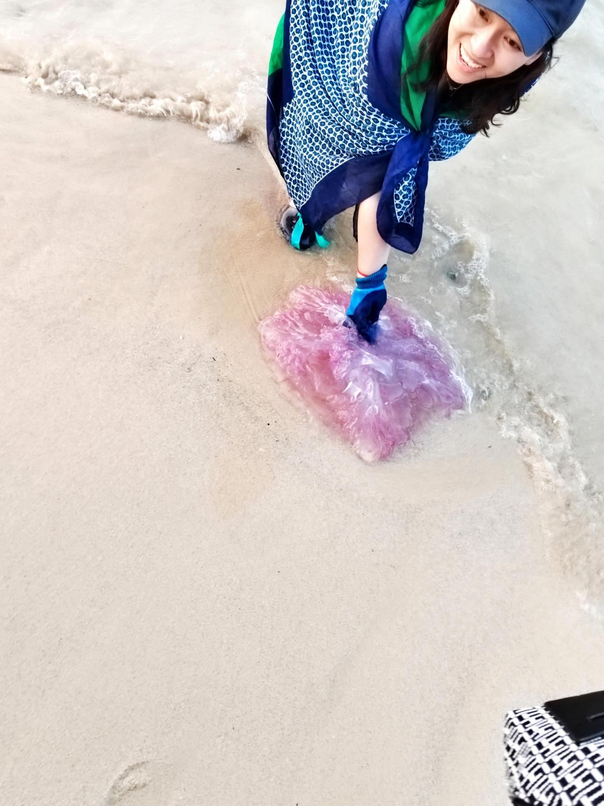

**普吉岛（Phuket)**
# 事前规划
>计划和变化的对立与统一，按部就班和率性随意需要结合  

提前几个月（23.9.22）就有考虑要带家人过年期间去国外游玩一次，因为知道泰国免签证到24.2月。
但后面一度打算cancel掉，过年还是回老家：孩子们也是喜欢玩雪的，老丈人家附近景点虽然去过多次，再泡泡温泉也行。  
几经思考，元旦前决定还是出游，年前出游，过完年再回老家。所以12.29携程下单，购买往返机票（共RMB 5290，去程2268+766，回程1692+564.12岁儿童票并没有啥优惠，不知道为啥分开显示）、普吉酒店、租车。过了两天突然发现香港飞机太早，七点多，根本没法赶过去，只能再下单香港酒店。

汇丰钻石卡下来，发现有不少不错的权益，可以一年两次珠三角跨境接送机。不过似乎不好操作，我预约了好多次才最终成功。由至尊车行接送，七座商务车，预约后会电话确认，也会提前短信通知行程，当然可以自己打电话更改行程，例如我的是改成到香港荃湾的酒店。在考虑是否明年直接预约到浪茄湾附近万宜水库东坝之类地方。

# 行程start
>千里之行始于足下

#  抵港，开始旅游
飞机落地普吉国际机场之前已经看到印度洋安曼达海，看起来波光粼粼，浪涛虽然有但不大。
当地时间比国内晚一个钟，所以是早上10点多到港，下飞机后顺利过海关，然后就是找租车地点了。这个耗费了半个小时以上，由于是从携程租车，它又是转了不知道几手到当地租车公司的，而我并不清楚该租车公司位置，加上自认为有美国租车经验，导致浪费不少时间在国际接机出口。只能说当地接机有点草台班子，跟国内小城市十年前一样很多人围着出口，也有旅行社分列站立在出口通道两旁，不少是举着“携程”“ctrip”牌子的，把我严重误导了，以为只要仔细找就能找到。不过那些人还挺好的，好几个看了我的行程单后帮忙指引，虽然不对但也多谢他们了。
虽然不断联系、通过google地图确认位置，还是一头雾水，后面才终于搞明白过来，要顶着炎炎烈日————当时国内快过年很冷——去到另外一边的国内到达厅。然后大厅里面一堆各种旅行社租车公司的，硬是没有我要的。不得已用whatsapp联系租车公司人员，又经过艰难的英语沟通，我到三号门附近、她出来找我，这样才终于接上头。检验确认资料和驾驶证、国际翻译件后，另外有个皮肤深色的人过来领我去前面停车坪取车。
终于开上车，打开空调最大挡，给家人们吃点零食、稍稍安顿，然后努力熟悉适应右舵车和交通开车规则，小心翼翼地开到普吉预订的hostel。

登记入住后，大家都饿了，看了下地图，带家人到旁边的小店吃饭。价格便宜，也点了奶茶饮料，内人认为当时点的珍珠奶茶味道不错，后面没再遇到过。里面还有另外两家老外在吃饭，旁边桌的来得比我们晚点，还打望我们的菜式，估计西方人真不知道该咋点菜。吃完坐在炎热的午后的小店吹着电风扇，对比前天深圳冬天的隐隐冷冻，这边短袖短裤还嫌热，一时之间恍惚到有点不真实，普吉永不落幕的夏日啊。

旁边就是查龙寺，里面可能在举行活动法会，我想带他们去看看，但内人觉得有空再看（结果到离开都没看），所以就先回酒店睡会休息下，也好让他们初次出国兴奋的心情松弛下。订的六人间的房，都是单人床，房间非常简陋，环顾四壁萧然，我也就安慰家人穷游就是这样。其实进门前房间左边走廊过道有吸食大麻的工具在，空气也臭臭的，可是自己没意识到这是大麻气味，当时还想挺下住这里，虽然比想象中还差。  
睡醒后到近四点了，开车带他们去环岛。岛上开车还是有点塞的，先到了拉威海滩，由于太阳到西边了，感觉并不理想。停车在路边是蛮方便的，也不需要停车费，怪不得普吉游人如织。
然后打算去网上提到的观景点看落日，结果路过yanui beach，挪不开脚了，硬是在离目的地3分钟的地方玩到天黑，了解了租小船和浮潜眼罩价格，都挺不错，小船100铢一个人两个小时，浮潜的装备我们带了在车里，不需要租。
内人已经约了第二天出海跳岛游，所以也没正式下水。

不过海边沙滩玩时内人看到了一大团紫色的东西，居然是死掉的水母，孩子们大感惊奇。

晚上就在沙滩附近的一家吃了，有点贵，味道一般，我想让家人尝试下冬阴功汤，可惜失败了。儿子的菠萝饭看起来应该好吃。
本来想接着去芭东夜市看看，可是看导航很塞车就放弃了，给女儿买点咳嗽药后直接开了四五十分钟回hostel。

洗完澡，仔细查看床垫被单，发现非常不卫生，还有隐约不明斑迹。这下心急如焚，没法，只能去前台沟通退房，换地方了。这家hostel我在携程支付843.04 CNY，酒店愿意退还2400铢，由于考虑孩子们身心健康，毫不犹豫答应了（其实心里都做好准备全部不退了的）。后续第二天跟携程沟通，发送自己拍照的不卫生的证据，再提出有大麻标识为啥平台不描述清楚，最终由携程返还可提现的现金券￥200，大概折损￥160。这个教训对我而言挺大的，不能贪便宜省钱。

退完房间搬完东西后，已经是晚上十点。只能搜索附近的酒店，开车过去碰碰运气了。连着找了两三家，都没空房或者压根没有值班人员，只有保安。已经到了晚上十一点了，无可奈何下甚至想着到车里将就窝一个晚上算了，但小车根本不可能躺下四个人，开窗蚊子又多。这个时候面对家人真是压力巨大————本想出来开心下，结果酒店栽了个大跟头。
福至心灵，在内人提议下，打开高德地图搜镇上酒店，终于找到一家叫珍珠酒店的标识3星的，一看双床不到五百一晚，赶紧下单四晚。然后开车过去镇上，才发现镇上还是有不少人的，街道密集，灯红酒绿

