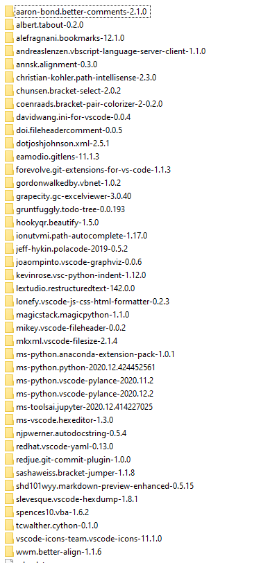

[安装脚本](#section1)  
[VSC扩展库](#section2)  

>VSCode+Python   
**bat脚本**  

if "%PROCESSOR_ARCHITECTURE%"=="x86" goto x86  
if "%PROCESSOR_ARCHITECTURE%"=="AMD64" goto x64  
goto exitentry  

:x64  
echo 64bit  
call "%\~dp07-Zip\7z.exe" x "%\~dp0Python3.7.5_32bit.7z" -oc:\Apps  
call "%\~dp0VSCodeUserSetup-x64-1.56.2.exe"  
call "%\~dp07-Zip\7z.exe" x "%\~dp0extensions.7z" -o%userprofile%\.vscode  
call "%\~dp07-Zip\7z.exe" x "%\~dp0User.7z" -o%userprofile%\AppData\Roaming\Code\User  
rem call "%\~dp0Git-2.29.2.2-64-bit.exe"  
rem call "%\~dp0TortoiseGit-2.11.0.0-64bit.msi"  
goto exitentry  
 
:x86  
echo 32bit  
call "%\~dp07-Zip\7z.exe" x "%\~dp0Python3.7.5_32bit.7z" -oc:\Apps  
call "%\~dp0VSCodeUserSetup-ia32-1.52.0.exe"  
call "%\~dp07-Zip\7z.exe" x "%\~dp0extensions.7z" -o%userprofile%\.vscode  
call "%\~dp07-Zip\7z.exe" x "%\~dp0User.7z" -o%userprofile%\AppData\Roaming\Code\User  
rem call "%\~dp0Git-2.29.2.2-64-bit.exe"  
rem call "%\~dp0TortoiseGit-2.11.0.0-64bit.msi"  
goto exitentry  

---
  
extension can have func_timeout  
>other packages from VSCode 
